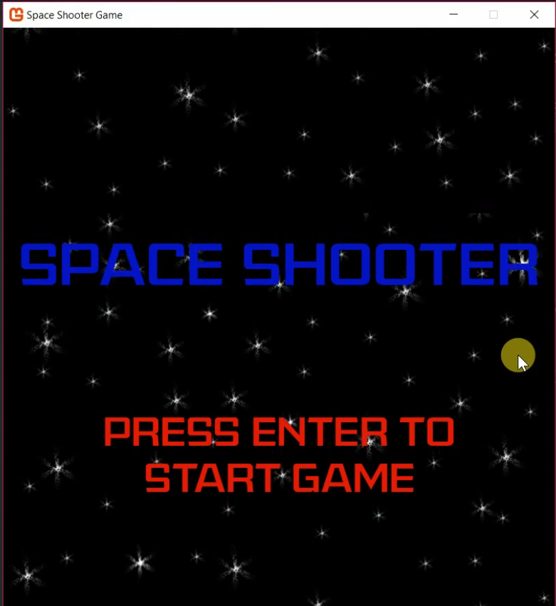
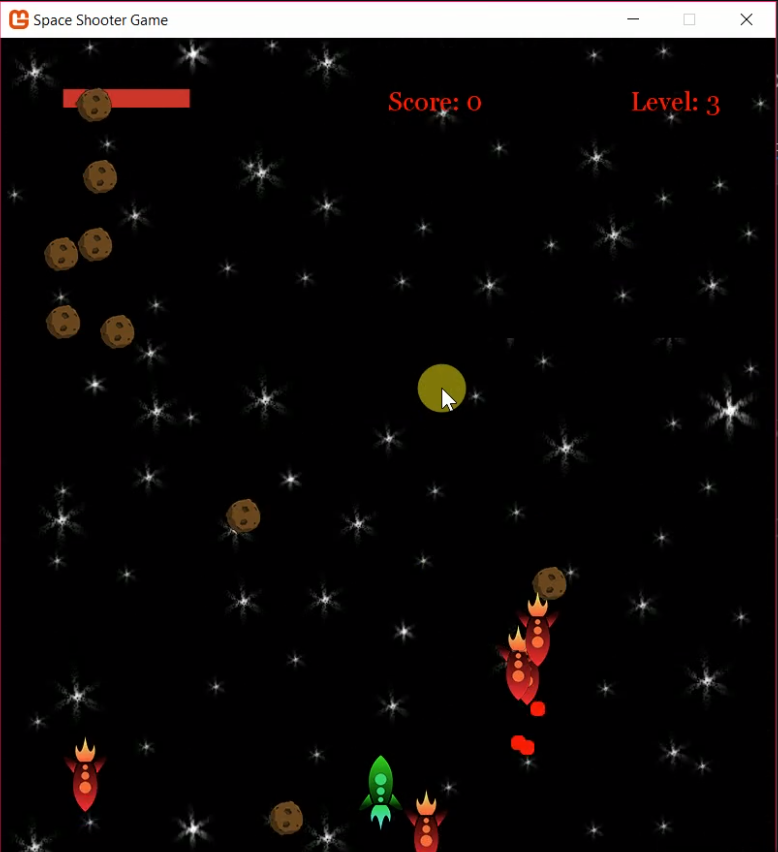
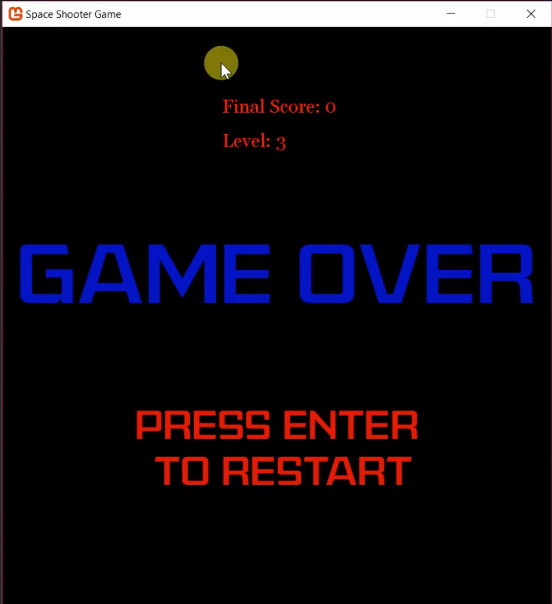

# Shoot-Em-Up

This project was inspired by a classic game of space invaders. Create using C# on Visual Studio (Windows). Media assisted with Monogame Pipeline.   

## Installation

1. Clone repository
2. If on Windows, load up a code editor like Visual Studio or VS Code, simply run it
  - If on Linux (like Ubuntu)
  - May need additional installations and windows server drivers to run it, or dockerize as an image

## Usage

Play game in action:
Arrow keys to move up space ship, down, left right
Space bar to shoot asteroids

Aim of the Game:
Get to level 3 without losing health, shoot as many asteroids as you can and try and get a high score!

## Demo
View the demo of the game! (video.mp4) 

## Video Screenshots
  

## Contributing
Pull requests are welcome. For major changes, please open an issue first to discuss what you would like to change, including the physics, game rules, and any addition features of the game.

## License
[MIT](https://choosealicense.com/licenses/mit/)
